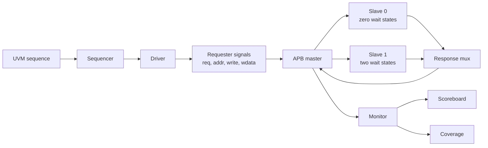
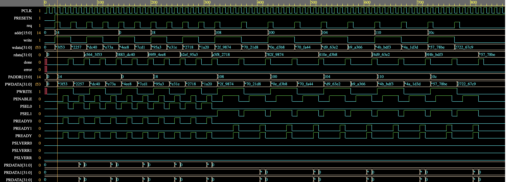
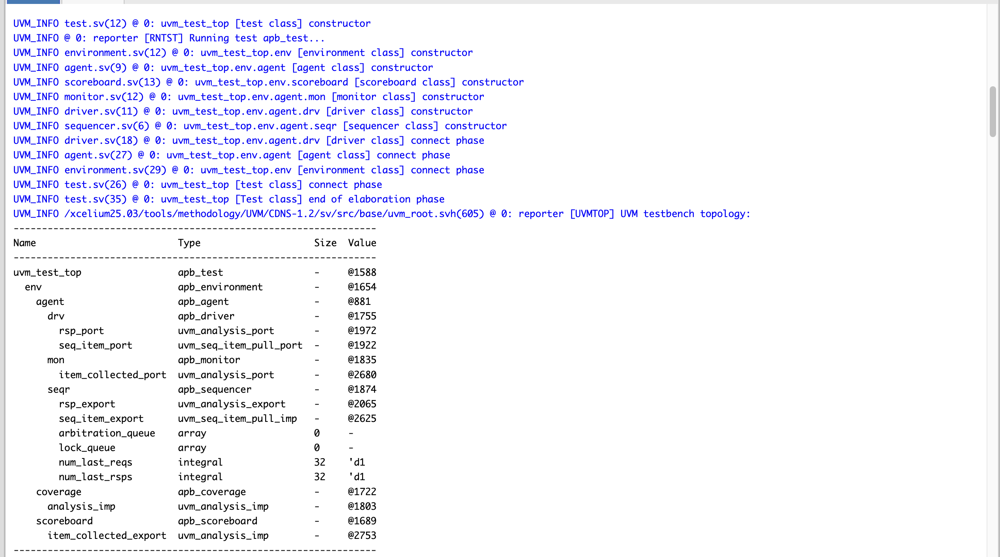
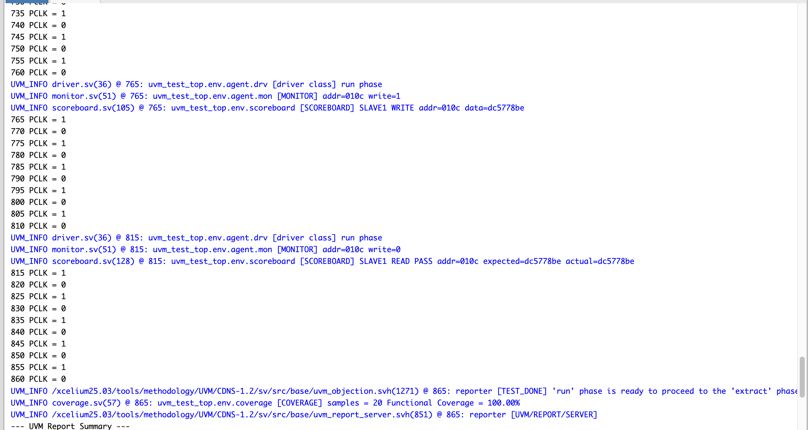
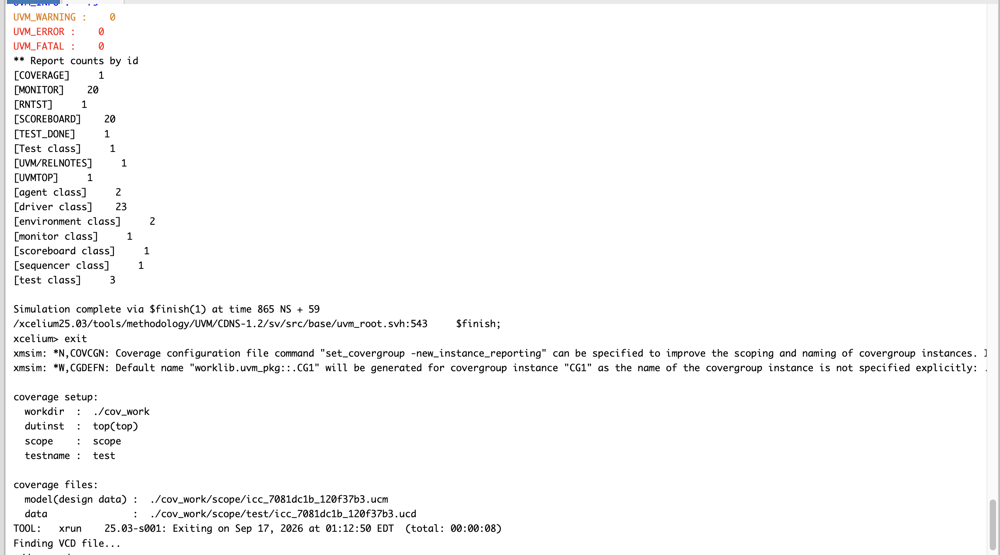

# APB Multi-Slave UVM Verification

This project implements and verifies a simple APB-based subsystem with one master and two memory-mapped slaves. The UVM testbench generates requester-side transactions, monitors completed APB transfers, checks read data and slave selection with a reference model, and measures functional coverage.

## Project features

- 16-bit address and 32-bit data paths
- APB master state machine with IDLE, SETUP, and ACCESS states
- two memory-mapped slaves with eight 32-bit registers each
- Slave 0 responds without wait states
- Slave 1 inserts two wait states
- clocking blocks and modports for driver and monitor timing
- UVM sequence, sequencer, driver, monitor, agent, environment, and test
- scoreboard with separate reference memories for both slaves
- balanced and write-readback sequences
- functional coverage for slave selection and read/write operations
- SystemVerilog assertions for protocol behavior

## Architecture



The UVM driver controls the requester-side interface. The RTL master converts each request into APB SETUP and ACCESS phases. The monitor samples only completed transfers when a slave is selected and both `PENABLE` and `PREADY` are high.

## Address map

| Slave | Register addresses | Registers | Response |
| --- | --- | ---: | --- |
| Slave 0 | `0x0000` to `0x001C`, word aligned | 8 x 32-bit | no wait states |
| Slave 1 | `0x0100` to `0x011C`, word aligned | 8 x 32-bit | two wait states |

Each register address is calculated as `base_address + (register_index * 4)`.

## Verification flow

1. The sequence creates an `apb_seq_item`.
2. The driver sends `req`, `addr`, `write`, and `wdata` through the driver clocking block.
3. The RTL master performs the APB transfer.
4. The monitor samples the completed transfer through the monitor clocking block.
5. The monitor broadcasts the transaction to the scoreboard and coverage subscriber.
6. The scoreboard updates or checks its reference memory.
7. The coverage subscriber samples the slave and operation type.

## Test sequences

### Constrained-random sequence

`apb_sequence` generates 20 legal, word-aligned transactions across both slaves with an equal read/write distribution.

### Balanced sequence

`apb_balanced_sequence` generates:

- 5 Slave 0 writes
- 5 Slave 0 reads
- 5 Slave 1 writes
- 5 Slave 1 reads

### Write-readback sequence

`apb_write_read_sequence` writes random data to a legal address and then reads the same address. It performs five write-read pairs on each slave. The default `apb_test` runs this sequence.

## Scoreboard

The scoreboard keeps independent reference memories for Slave 0 and Slave 1. It checks:

- correct slave selection for each address range
- unexpected error responses
- read data against the expected stored value
- invalid monitored addresses

## Functional coverage

The coverage model contains:

- read and write bins
- Slave 0 and Slave 1 address-range bins
- cross coverage between slave selection and operation type

The supplied write-readback run sampled 20 completed transfers and reached **100.00% functional coverage** for this coverage model.

## Assertions

| Assertion | Check |
| --- | --- |
| `a_one_slave` | Slave 0 and Slave 1 are never selected together |
| `a_setup_to_access` | SETUP is followed by ACCESS |
| `a_enable_with_select` | `PENABLE` is only asserted with a selected slave |
| `a_addr_stable` | Address stays stable during wait states |
| `a_write_stable` | Read/write control stays stable during wait states |
| `a_wdata_stable` | Write data stays stable during write wait states |
| `a_select_stable` | Slave selection stays stable during wait states |
| `a_reset` | Select and enable signals remain inactive during reset |

## Results

### APB waveform



### UVM topology



### Scoreboard and coverage



### UVM report summary



The supplied run completed with:

- 20 monitored transfers
- 20 scoreboard transactions
- 100.00% functional coverage
- 0 UVM warnings
- 0 UVM errors
- 0 UVM fatals

## Project structure

```text
.
├── master.sv
├── slave0.sv
├── slave1.sv
├── output_mux.sv
├── design.sv
├── assertions.sv
├── interface.sv
├── seq_item.sv
├── sequence.sv
├── sequencer.sv
├── driver.sv
├── monitor.sv
├── agent.sv
├── scoreboard.sv
├── coverage.sv
├── environment.sv
├── test.sv
├── testbench.sv
├── run_xcelium.sh
└── results/
```

## Running the project

### Cadence Xcelium

The helper script enables UVM and coverage:

```bash
chmod +x run_xcelium.sh
./run_xcelium.sh
```

### EDA Playground

1. Select Cadence Xcelium and enable UVM 1.2.
2. Add the SystemVerilog source files.
3. Use `design.sv` and `testbench.sv` as the compiled top-level source files.
4. Add `-coverage all` to the run options.
5. Run the simulation and open `dump.vcd` in EPWave.

## Scope

This is a learning-focused APB/UVM project. It demonstrates protocol phases, slave decoding, wait states, reusable UVM structure, self-checking readback, coverage, and assertions. It is not intended to be a complete AMBA APB compliance test suite.
